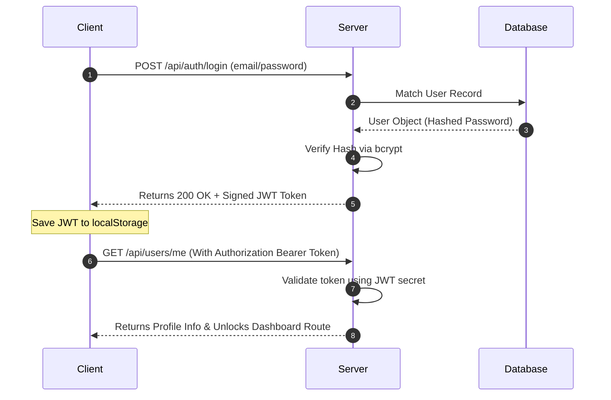

# 🛡️ Full Stack Authentication System

[](LICENSE)
[](https://react.dev/)
[](https://www.typescriptlang.org/)
[](https://nodejs.org/)
[](https://www.mysql.com/)

A premium, highly secure, and production-ready Full Stack Authentication & Profile Management system. Developed as a technical assessment, this architecture demonstrates modern web development best practices: combining a type-safe **React-TypeScript frontend** with a robust **Express-MySQL backend**, unified under strict JWT token-based authentication.

---

## 🎯 Key Features

### 💻 Frontend (Client Dashboard)
* **🔒 Secure Router Guarding:** Private routes configured via React Router to auto-redirect unauthenticated requests.
* **⚡ Type-Safe State Management:** Built entirely with TypeScript for zero runtime type exceptions.
* **🎨 Modern UI/UX Design:** Crafted using Tailwind CSS, featuring beautiful transitions, responsive grid layouts, interactive input validation states, and a clean professional aesthetic.
* **🔄 State Synchronization:** Immediate client-side updates upon updating user profiles, integrated with custom API interceptors.

### ⚙️ Backend (API Server)
* **🔑 JWT-Based Session Lifecycle:** Secure login generation issuing transient JSON Web Tokens with robust verification middleware.
* **🛡️ Password Hashing:** Modern cryptographic salt-hashing using `bcrypt` preventing brute-force dictionary compromise.
* **🗄️ Scalable Database Schema:** Clean relational architecture designed for MySQL with automated user lifecycle queries.
* **🔌 CORS Enabled & Protected Routes:** Secured server endpoints with pre-flight check layers and automated error handlers.

---

## 🏗️ Project Architecture & Directory Structure

```text
Demo_Task_ByteKloud_Bangluru/
├── demoTask/               # Frontend Client (React + Vite + TS)
│   ├── src/
│   │   ├── components/     # UI, Inputs, & Guarded Route wrappers
│   │   ├── pages/          # Login, Register, & User Dashboard
│   │   ├── services/       # Axios API client instances
│   │   └── App.tsx         # Root Router configuration
│   ├── package.json
│   └── tsconfig.json
├── server/                 # Backend API (Node.js + Express)
│   ├── config/             # Database connection configurations
│   ├── middleware/         # JWT Verification & Express Route Guards
│   ├── routes/             # Authentication & User Profile endpoints
│   ├── server.js           # Express Application entrypoint
│   └── package.json
├── users.sql               # Database initialization & Seeding script
├── .gitignore              # Version control ignore lists
└── README.md               # Documentation
```

---

## 🧰 Tech Stack Breakdown

| Component | Technology | Primary Function |
| :--- | :--- | :--- |
| **Frontend UI** | `React 18` + `Tailwind CSS` | Client interface, UI rendering, layout design |
| **Type Safety** | `TypeScript` | Static type checks, data structures interface contract |
| **API Client** | `Axios` | Asynchronous REST communication with Bearer Token integration |
| **Backend Runtime** | `Node.js` + `Express` | API Router management, authentication middleware layer |
| **Database Engine**| `MySQL` | Persisted relational user profile data |
| **Security Suite** | `JWT` + `bcrypt` | Symmetric secret encryption, password salting |

---

## ⚙️ Installation & Setup Guide

### 📋 Prerequisites
* Install [Node.js](https://nodejs.org/) (v16+ recommended)
* Install [MySQL Server](https://dev.mysql.com/downloads/installer/)

---

### Step 1: Database Setup

Before launching the servers, prepare your relational schema using the included SQL script.

1. Open your terminal or MySQL Workbench.
2. Log into your MySQL CLI server:
   ```bash
   mysql -u root -p
   ```
3. Create your schema, select it, and run the schema setup script using the `users.sql` file provided in the repository root directory:
   ```sql
   CREATE DATABASE IF NOT EXISTS your_database_name;
   USE your_database_name;
   SOURCE /path/to/users.sql;
   ```

*Alternatively, manually execute this query inside your MySQL console:*

```sql
CREATE TABLE IF NOT EXISTS users (
  id INT AUTO_INCREMENT PRIMARY KEY,
  name VARCHAR(255) NOT NULL,
  email VARCHAR(255) UNIQUE NOT NULL,
  password VARCHAR(255) NOT NULL,
  phone VARCHAR(20),
  created_at TIMESTAMP DEFAULT CURRENT_TIMESTAMP
);

-- Seed a default user (Password: password123)
INSERT INTO users (name, email, password, phone)
VALUES ('Test User', 'test@example.com', '$2b$10$UqSgshC3B/TzP67FscxYQOMF0qGzH09qGjD3j7eIAnTqC956YFeqi', '9999999999');
```

---

### Step 2: Backend Configuration (`server`)

1. Navigate to the backend directory:
   ```bash
   cd server
   ```
2. Install dependencies:
   ```bash
   npm install
   ```
3. Create a `.env` file in the root of the `server/` directory:
   ```env
   PORT=5000
   DB_HOST=localhost
   DB_USER=your_mysql_username
   DB_PASSWORD=your_mysql_password
   DB_NAME=your_database_name
   JWT_SECRET=your_super_secret_jwt_key
   ```
4. Start the backend development server:
   ```bash
   npm run start
   ```
   *The server runs locally on: `http://localhost:5000`*

---

### Step 3: Frontend Configuration (`demoTask`)

1. Open a new terminal instance and navigate to the frontend folder:
   ```bash
   cd demoTask
   ```
2. Install dependency modules:
   ```bash
   npm install
   ```
3. Start the Vite React client:
   ```bash
   npm run dev
   ```
   *The client app fires up on: `http://localhost:5173`*

---

## 🔐 Authentication Flow



* **Storage Strategy:** Received JWT is securely stored in client-side storage and injected inside request headers asynchronously through an **Axios Interceptor** block.
* **Auto-Purge Strategy:** Triggering `Logout` immediately drops cached instances from browser memories and redirects to the public entry gateway.

---

## 🔌 API Endpoints Reference

| Method | Endpoint | Authorization | Description |
| :--- | :--- | :--- | :--- |
| **`POST`** | `/api/auth/login` | Public | Validates user credentials; returns JWT session token |
| **`POST`** | `/api/auth/register` | Public | Registers a new account and encrypts password |
| **`GET`** | `/api/users/me` | Private (Bearer) | Validates active Token and retrieves profile context |
| **`PUT`** | `/api/users/profile` | Private (Bearer) | Updates phone number and display name details |

---

## 🛡️ Security Best Practices Implemented

* **Secure Hashing:** Never stores plain-text user passwords. System leverages `bcrypt` with `10 salt rounds` execution hashes.
* **JWT Expiration Handlers:** Protects users against session highjacking by enforcing dynamic expiration rules.
* **Controlled Cross-Origin Requests:** CORS configuration prevents arbitrary foreign domains from executing API mutations.
* **SQL Injection Shield:** All database queries are parsed and routed using **parameterized SQL queries** internally.

---

## 🙋‍♂️ Contributing

Contributions are what make the open-source community such an amazing place to learn, inspire, and create. Any contributions you make are **greatly appreciated**.

1. Fork the Project
2. Create your Feature Branch (`git checkout -b feature/AmazingFeature`)
3. Commit your Changes (`git commit -m 'Add some AmazingFeature'`)
4. Push to the Branch (`git push origin feature/AmazingFeature`)
5. Open a Pull Request

---

## 📄 License

Distributed under the MIT License. See [Alok Kumar Panday](https://github.com/Alok345) for more details.

---

Developed with ❤️ by [Alok Kumar Panday](https://github.com/Alok345)